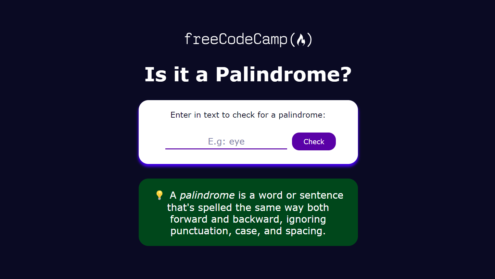

# Palindrome Checker - Solution

### Welcome! 👋  

This project is the first of five in the [JavaScript Algorithms and Data Structures (Beta)](https://www.freecodecamp.org/learn/javascript-algorithms-and-data-structures-v8/) curriculum on freeCodeCamp.
  

**Preview solution:** [palindrome-checker](https://manuelscl.github.io/palindrome-checker)

**freeCodeCamp Profile:** [@manuelscl](https://www.freecodecamp.org/manuelscl)